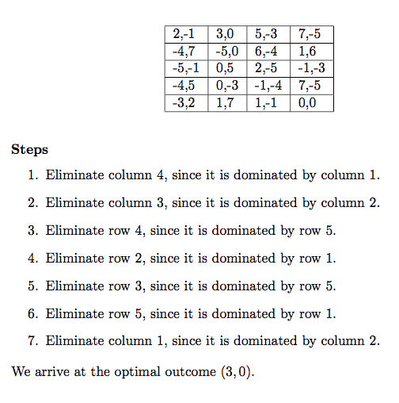

#Game theory problem generator

I have recently been teaching Finite Mathematics at Furman University.  In our final chapter of the course, the students learned about the basics of game theory.  One method discussed is Iterated Elimination of Strictly Dominated Strategies, or IESDS for short.

However, I have found it surprisingly difficult to find a body of practice problems for students to learn from.  After growing tired of hand-writing these problems, I decided to write a script to generate them automatically.

## How it works
The script simply works backwards from a desired solution, adding dominated partial rows and columns to fill up a matrix.  The beauty of doing so is that the script can keep track of the steps it takes, and then simply reverse them to generate step-by-step solutions to walk students through the problem.

## Usage
This is a simple script for my own usage, so it is not very polished.  If you would like to use it, open it up, and look for variables to tweak to your liking.  For example, the bounds on the random numbers used for the payoff values, matrix dimensions, number of problems, etc.

## LaTeX
The script sends the output to 2 .tex files, one for problems, one for solutions.  The LaTeX is pretty rudimentary, and could use some beautification.  To produce nice PDFs, open the files with your favorite TeX editor and render them.

Check the examples folder for the output (and rendered PDFs) of one run that I gave to my students for practice before a test.
